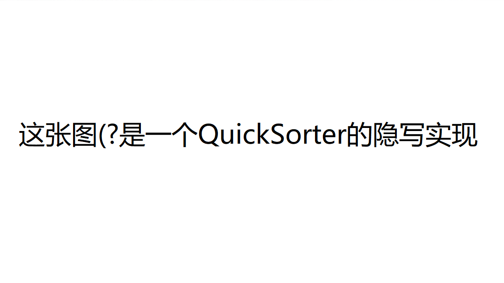
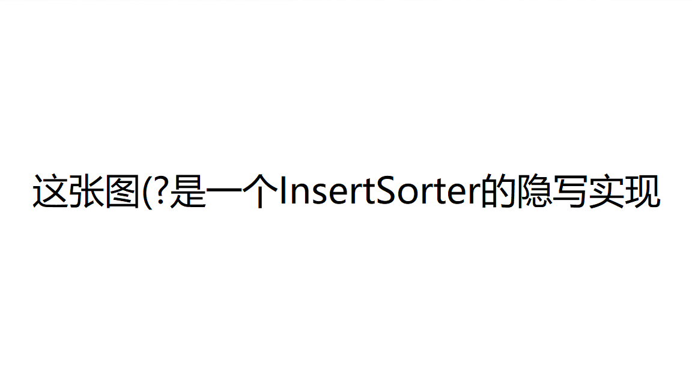

### 1. 实现

```java
SteganographyClassLoader loader = new SteganographyClassLoader(
        new URL("https://cdn.njuics.cn/example.BubbleSorter.png"));

Class c = loader.loadClass("example.QuickSorter");
```

自定义ClassLoader "SteganographyClassLoader"

构造函数中传入隐写后图片的URL,实例化一个SteganographyClassLoader 命名为loader，调用ClassLoader类(SteganographyClassLoader的super class)中loadClass方法，按照双亲委派模型进行查找.

> ```java
> public SteganographyClassLoader(URL imageURL) {
>     super();
>     this.url = imageURL;
> }
> //调用super()，即ClassLoader的构造函数,跳转到如下
> protected ClassLoader() {
>         this(checkCreateClassLoader(), null, getSystemClassLoader());
>     }
> //再次调用Classloader的构造函数，其中parent为getSystemClassLoader()，返回AppClassLoader
> ```

>```java
>if (parent != null) {
>    c = parent.loadClass(name, false);
>}
>    //递归查找classloader的parent
>    //SteganographyClassLoader->AppClassLoader->PlatformClassLoader->BootstrapClassLoader
>```

没有找到就调用SteganographyClassLoader类中覆写的findClass方法.

SteganographyClassLoader类中覆写的findClass方法会

* 读取url的图片
* 实例化一个参数为url的SteganographyEncoder类
* 调用SteganographyEncoder的decodeByteArray方法，即解码，存入二进制数组 bytes里
* defineClass 传入类加载的参数(类的名字，.class的二进制编码，起始，长度)，返回这个class

* 这个class即为图片隐写的xxxxSorter

```java
Sorter sorter = (Sorter) c.newInstance();
```

### 2.隐写图

#### QuickSorter



#### InsertSorter



### 3.排序jw02

[Java 03 SteganographyClassLoader_哔哩哔哩_bilibili](https://www.bilibili.com/video/BV1Z44y147Vn?spm_id_from=333.999.0.0)

### 4.同学Sorter

[jw03-Mars-Z777](https://github.com/jwork-2021/jw03-Mars-Z777)/**example.ChooseSorter.png**

用了这位同学的ChooseSorter，结果正确